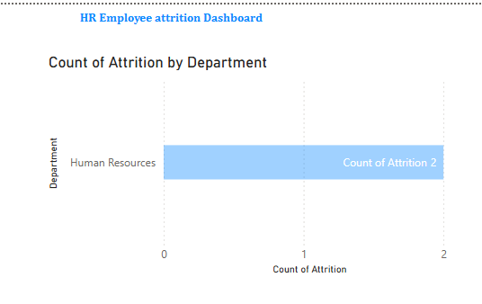

# HR-Attrition-Dashboard.
Interactive Power BI dashboard for analyzing HR employee attrition trends. Includes key metrics such as attrition rate, department-wise turnover, age group insights, and tenure analysis. Built using Power BI with DAX measures and interactive slicers for dynamic filtering.

## Overview
This project features an interactive Power BI dashboard that visualizes employee attrition trends using HR data. The goal is to help HR teams and decision-makers understand key factors behind employee turnover across departments, age groups, and tenure.

---

## Features
- **Attrition Rate KPI**: Overall percentage of employees who left.
- **Attrition by Department**: Visual breakdown of attrition count per department.
- **Attrition by Age Group**: Analysis of attrition across age ranges (20-30, 31-40, etc.).
- **Attrition by Years at Company**: Visualizes tenure and its correlation with attrition.
- **Interactive Filters/Slicers**:
  - Department
  - Gender
  - Job Role
  - Age Group

---

## Tools Used
- **Power BI Desktop** for dashboard design and data visualization.
- **DAX** for calculated measures and columns.
- **CSV Dataset** containing employee HR data.

---

## How to Use
1. Clone or download the repository.
2. Open the `.pbix` file in Power BI Desktop.
3. Use the slicers to interact with and filter the data.
4. Analyze the dashboard to draw insights from attrition trends.

---

## Dataset
The dataset includes employee demographics, job roles, salaries, satisfaction scores, and attrition status.

Key Columns:
- Age
- Department
- Job Role
- Monthly Income
- Attrition (Yes/No)
- Years at Company
- Education, Gender, Environment Satisfaction, etc.

---

## Key Insights
- The **Research & Development** department experienced the highest attrition.
- Attrition was most frequent among employees aged **31–40**, followed by **20–30**.
- Majority of attrition occurred within the first **5 years** of employment.
- Overall **Attrition Rate**: ~13% (based on sample dataset).

---

## Files Included
- `HR-Employee-Attrition.pbix` — Power BI dashboard file.
- `HR-Employee-Attrition.csv` — Dataset used for analysis.
- `dashboard-preview.png` — Screenshot of the dashboard.
- `README.md` — Project documentation.

---

## Preview

---

## Author
**Your Name**  
[LinkedIn]https://www.linkedin.com/in/aditya-sawant-9889431b2/  | [GitHub][(https://github.com/aditya250)

---

## Dataset Source
The dataset used for this dashboard can be downloaded from Kaggle:  
🔗 [HR Employee Attrition Dataset on Kaggle](https://www.kaggle.com/datasets/saurabhbadole/hr-employee-attrition?resource=download)

## License
This project is open-source for educational and portfolio purposes.
